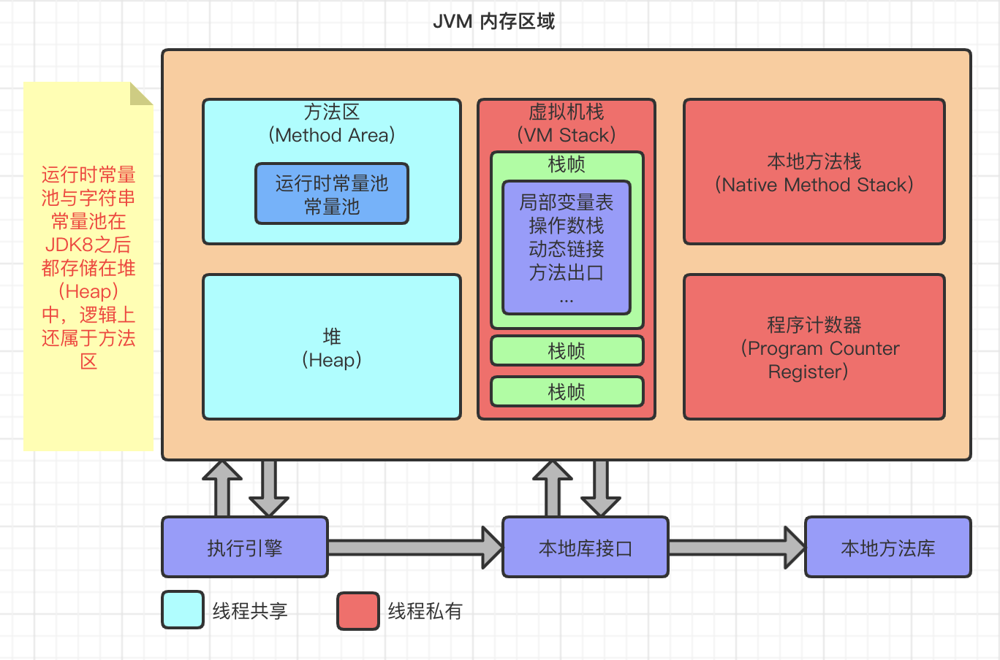
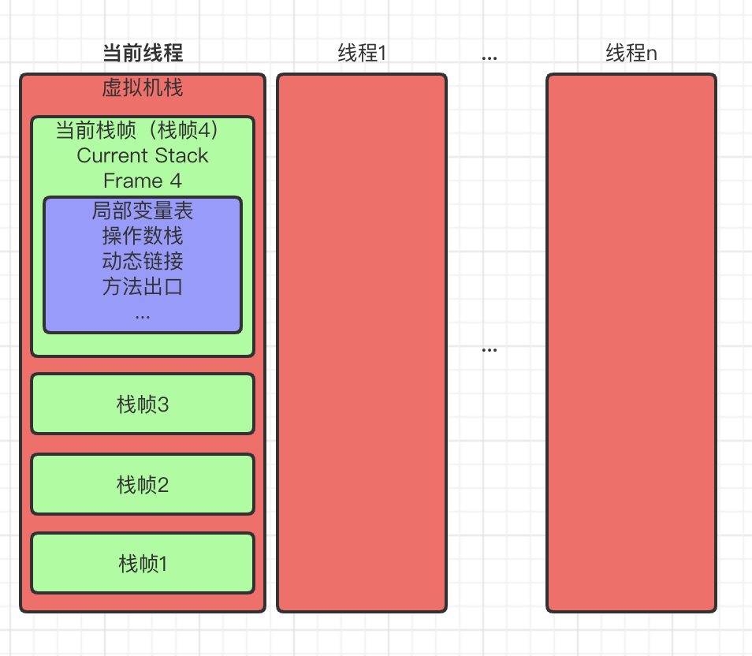

- # **1、JVM**

  - **基本概念：**JVM 是一个可以执行 Java 字节码的虚拟机进程。Java 源文件被编译成能被 Java 虚拟机执行的字节码文件( `.class` )。Java 之所以能够跨平台不是由于 JVM，JVM是不能跨平台的，在不同的平台需要安装不同版本的 JDK。而真正跨平台的是 Java 程序即：Java字节码。
  - **运行过程：**Java源文件通过编译器，生成相应的`.class `文件(字节码文件)，而字节码文件又通过 JVM 的解释器编译成特定机器上的机器码。每一种平台的解释器是不同的，但是实现的虚拟机是相同的，这也就是 Java 能够跨平台的原因。

  ## 1.1 JVM运行时数据区

  JVM 运行时数据区主要分为线程私有区域`虚拟机栈`、`本地方法栈`、`程序计数器`和线程共享区域`方法区`、`堆`和`直接内存`。

  线程私有数据区域生命周期与线程相同, 依赖用户线程的启动/结束 而 创建/销毁(在 Hotspot VM 内, 每个线程都与操作系统的本地线程直接映射, 因此这部分内存区域的存/否跟随本地线程的生/死对应)。线程共享区域随虚拟机的启动/关闭而创建/销毁。

  `直接内存`并不是 JVM 运行时数据区的一部分, 但也会被频繁的使用: 在 JDK 1.4 引入的 NIO 提供了基于 Channel 与 Buffer 的 IO 方式, 它可以使用 Native 函数库直接分配堆外内存, 然后使用 DirectByteBuffer 对象作为这块内存的引用进行操作(详见: Java I/O 扩展), 这样就避免了在 Java 堆和 Native 堆中来回复制数据, 因此在一些场景中可以显著提高性能。

  

  ### 1.1.1 程序计数器（线程私有）

  一块较小的内存空间, 是当前线程所执行的字节码的行号指示器，每条线程都要有一个独立的程序计数器，这类内存也称为`“线程私有”`的内存。正在执行 Java 方法的话，计数器记录的是虚拟机字节码指令的地址（当前指令的地址）。如果还是 Native 方法，则为空。`这个内存区域是唯一一个在虚拟机中没有规定任何 OutOfMemoryError 情况的区域。`

  ### 1.1.2 虚拟机栈（线程私有）

  是描述 Java 方法执行的内存模型，每个方法在执行的同时都会创建一个栈帧（Stack Frame）用于存储`局部变量表`、`操作数栈`、`动态链接`、`方法出口`等信息。每一个方法从调用直至执行完成的过程，就对应着一个栈帧在虚拟机栈中入栈到出栈的过程。

  `栈帧`（ Frame）是用来存储数据和部分过程结果的数据结构，同时也被用来处理动态链接(Dynamic Linking)、 方法返回值和异常分派（Dispatch Exception）。栈帧随着方法调用而创建，随着方法结束而销毁——无论方法是正常完成还是异常完成（抛出了在方法内未被捕获的异常）都算作方法结束。

  

  ### 1.1.3 本地方法栈（线程私有）

  本地方法区和 Java Stack 作用类似, 区别是虚拟机栈为执行 Java 方法服务, 而本地方法栈则为Native 方法服务, 如果一个 VM 实现使用 C-linkage 模型来支持 Native 调用, 那么该栈将会是一个 C 栈，但 HotSpot VM 直接就把本地方法栈和虚拟机栈合二为一。

  ### 1.1.4 堆（线程共享）

  是被线程共享的一块内存区域，创建的对象和数组都保存在 Java 堆内存中，也是垃圾收集器进行垃圾收集的最重要的内存区域。由于现代 VM 采用**分代收集算法**, 因此 Java 堆从 GC 的角度还可以细分为: **新生代**(`Eden 区`、`From Survivor 区`和 `To Survivor 区`)和**老年代。**

  ### 1.1.5 方法区（线程共享）

  即我们常说的**永久代(Permanent Generation)**，用于存储**被 JVM 加载的类信息**、**常量**、**静态变量**、**即时编译器编译后的代码**等数据。方法区和永久代的关系很像 Java 中接口和类的关系，类实现了接口，而永久代就是 HotSpot 虚拟机对虚拟机规范中方法区的一种实现方式。HotSpot VM 把 GC 分代收集扩展至方法区, 即**使用Java堆的永久代来实现方法区**, 这样 HotSpot 的垃圾收集器就可以像管理 Java 堆一样管理这部分内存, 而不必为方法区开发专门的内存管理器(永久带的内存回收的主要目标是针对**常量池的回收**和**类型的卸载**, 因此收益一般很小)。运行时常量池（Runtime Constant Pool）是方法区的一部分。Class 文件中除了有类的版本、字段、方法、接口等描述等信息外，还有一项信息是常量池（Constant Pool Table），用于存放编译期生成的各种字面量和符号引用，这部分内容将在类加载后存放到方法区的运行时常量池中。 Java 虚拟机对 Class 文件的每一部分（自然也包括常量池）的格式都有严格的规定，每一个字节用于存储哪种数据都必须符合规范上的要求，这样才会被虚拟机认可、装载和执行。

  > 注: 运行时常量池和常量池物理上都存于堆内存，逻辑上依然属于方法区。即使在 JDK1.8移除了永久代，但在逻辑上依然会划分出方法区。

  ### 1.1.6 直接内存（线程共享）

  直接内存并不是虚拟机运行时数据区的一部分，也不是《Java虚拟机规范》中定义的内存区域。在 JDK1.8 中元空间(MetaSpace)使用的就是直接内存，它的容量大小可通过 `-XX：MaxDirectMemorySize` 参数指定，如果不指定，默认与Java堆最大值`-Xmx`一致。

  
